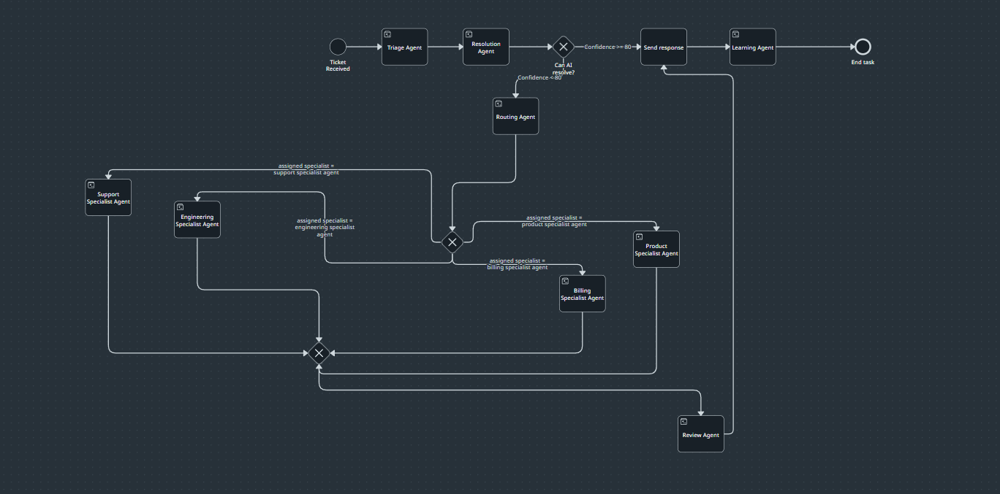

# Intelligent Customer Support Orchestration with UiPath Maestro

An AI-powered customer support automation platform built using **UiPath Maestro**, **Agent Builder**, and **BPMN orchestration**. The solution uses multiple specialized AI agents to triage, resolve, intelligently escalate, review, and continuously learn from customer support tickets.

---

## 🚀 Overview

Customer support teams often spend significant time manually classifying tickets, routing them to the correct department, drafting responses, and documenting resolutions. This solution automates the entire support lifecycle using AI while preserving quality through intelligent routing and review.

The workflow begins by analyzing incoming support tickets, automatically generating a resolution where possible. If the AI determines the issue cannot be confidently resolved, the ticket is routed to the appropriate specialist AI agent based on its category. After specialist review, a Quality Assurance agent validates the response before it is delivered to the customer. Finally, every resolved ticket is converted into a structured knowledge base article, enabling continuous organizational learning.

---


# 🔄 Workflow



---

# ✨ Features

- Intelligent ticket triage
- AI-generated customer resolutions
- Confidence-based automation
- Intelligent escalation and routing
- Specialized AI support agents
- Automated quality assurance
- Continuous knowledge base generation
- End-to-end BPMN orchestration using UiPath Maestro

---

# 🤖 AI Agents

The workflow consists of the following autonomous AI agents:

| Agent | Responsibility |
|--------|----------------|
| **Triage Agent** | Understands the ticket, classifies intent, category, severity, and sentiment. |
| **Resolution Agent** | Determines the root cause, generates a solution, and drafts a customer response. |
| **Routing Agent** | Routes unresolved tickets to the appropriate specialist AI agent. |
| **Support Specialist Agent** | Handles authentication, account access, configuration, and general support issues. |
| **Engineering Specialist Agent** | Handles software defects, API failures, crashes, infrastructure, and technical issues. |
| **Billing Specialist Agent** | Resolves billing, subscription, invoice, payment, and refund requests. |
| **Product Specialist Agent** | Processes feature requests, usability feedback, and product improvement suggestions. |
| **Review Agent** | Performs quality assurance on specialist responses before customer delivery. |
| **Learning Agent** | Converts resolved tickets into structured knowledge base articles for future reuse. |

---

# ⚙ Workflow Overview

```text
Customer Ticket
       │
       ▼
Triage Agent
       │
       ▼
Resolution Agent
       │
       ▼
Can AI Resolve?
       │
 ┌─────┴─────┐
 │           │
 ▼           ▼
Automatic   Routing Agent
Response          │
                  ▼
         Specialist AI Agent
                  │
                  ▼
            Review Agent
                  │
                  ▼
      Deliver Customer Response
                  │
                  ▼
           Learning Agent
                  │
                  ▼
          Knowledge Base
```

---

# 🧠 Routing Logic

When the Resolution Agent returns a confidence score below **80%**, the Escalation Manager Agent determines the most appropriate specialist.

| Issue Type | Assigned Specialist |
|------------|--------------------|
| Login / MFA / Account Access | Support Specialist |
| Bugs / Crashes / API Issues | Engineering Specialist |
| Billing / Refunds / Payments | Billing Specialist |
| Feature Requests / Feedback | Product Specialist |

---

# 🛠 UiPath Components Used

This project was built entirely using UiPath's low-code AI automation platform.

- UiPath Maestro
- BPMN Workflow Designer
- UiPath Agent Builder
- Autonomous Agentic Tasks
- Exclusive Gateways
- Variables
- AI Model Integration

---

# 🤖 Agent Type

**Low-code AI Agents built with UiPath Agent Builder**

This solution does **not** use coded agents. All AI agents were created using UiPath Agent Builder and orchestrated through UiPath Maestro.

---

# 📂 Repository Structure

```text
.
├── README.md
├── LICENSE
├── solution/
│   ├── solution.uis
│   └── workflow.bpmn
├── prompts/
│   ├── triage-agent.md
│   ├── resolution-agent.md
│   ├── routing-agent.md
│   ├── support-agent.md
│   ├── engineering-agent.md
│   ├── billing-agent.md
│   ├── product-agent.md
│   ├── review-agent.md
│   └── learning-agent.md
├── docs/
│   └── workflow.png
│   
│   
└── LICENSE
```

---

# 📦 Project Files

This repository contains everything required to understand and reproduce the solution.

- UiPath Solution package (`.uis`)
- BPMN workflow definition (`.bpmn`)
- AI agent prompts
- Architecture documentation
- Workflow diagrams
- Setup instructions

---

# 🚀 Setup Instructions

## Prerequisites

- UiPath Automation Cloud
- UiPath Maestro
- UiPath Agent Builder
- Access to a supported LLM (Gemini/OpenAI)

## Installation

1. Clone this repository.

```bash
git clone https://github.com/<username>/<repository>.git
```

2. Import the `solution.uis` package into UiPath Automation Cloud.

3. Open the BPMN workflow in UiPath Studio Web.

4. Configure the required AI model connections if prompted.

5. Publish the agents.

6. Run the Maestro workflow.

---

# 📊 Example Workflow

1. Customer submits a support ticket.
2. Triage Agent classifies the issue.
3. Resolution Agent generates a solution.
4. High-confidence responses are automatically delivered.
5. Low-confidence tickets are routed to a specialist AI agent.
6. Review Agent validates the response.
7. Final response is delivered to the customer.
8. Learning Agent creates a reusable knowledge base article.

---

# 🎯 Business Impact

This solution helps organizations:

- Reduce manual ticket triage
- Improve first-response time
- Automate repetitive customer support tasks
- Ensure consistent response quality
- Capture organizational knowledge automatically
- Scale support operations through AI orchestration

---

# 🔮 Future Improvements

- Live enterprise knowledge base retrieval
- Integration with CRM and ITSM platforms
- SLA monitoring and analytics dashboards
- Multi-language support
- Customer satisfaction prediction
- Historical ticket similarity search

---

# 📄 License

This project is licensed under the **MIT License**.
